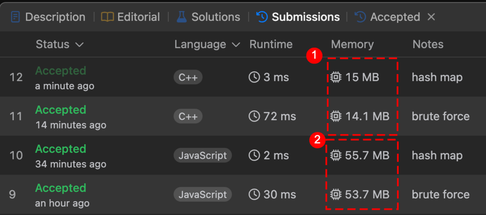

# two sum

| No  | Approach    | Time Complexity | Space Complexity | Summary                                  |
| --- | ----------- | --------------- | ---------------- | ---------------------------------------- |
| 1   | Brute Force | O(n²)           | O(1)             | Nested for-loops, compare all pairs      |
| 2   | Hash Map    | O(n)            | O(n)             | Use a map to find complement in one pass |

## comparison

- Hash map approach significantly reduces `speed`
- C++ implementation uses less `memory`

