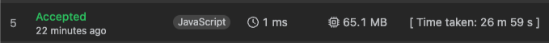

# Merge Two Sorted Lists

| No  | Approach          | Time Complexity | Space Complexity | Summary                                                            |
| --- | ----------------- | --------------- | ---------------- | ------------------------------------------------------------------ |
| 1   | Brute Force       | O(n²)           | O(1)             | Compare every possible pair of buy/sell days to find max profit    |
| 2   | Optimized(Greedy) | O(n)            | O(1)             | Track minimum price while iterating, update max profit dynamically |

## comparison

- ⚠️ C++ uses more `memory` than `js` implementation.

## Learn

- This problem is conceptually similar to "Kadane's Algorithm", which finds the maximum subarray sum.
- Instead of summing values, calculate max price difference after the lowest price.
- Tracking the minimum price seen so far and comparing with the current price gives optimal solution in one pass.
- Use this pattern when you need to maximize a difference under a constraint.
